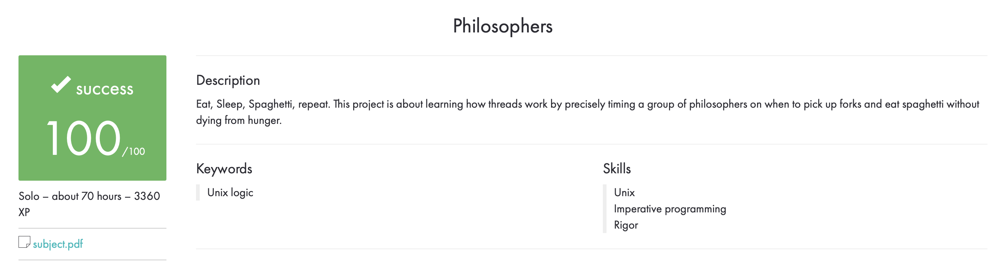

# Dining Philosophers Problem

## Description

The Dining Philosophers Problem is a classic synchronization problem in computer science. The problem involves a group of philosophers who sit around a circular table and alternately think and eat. Each philosopher must pick up two forks to eat, but there are only as many forks as there are philosophers. The challenge is to design a solution that allows the philosophers to eat without getting stuck in a deadlock or a starvation situation.



## Installation

1. Clone the repository
2. Navigate into the directory: `cd philo`
3. Compile the program by running `make`

## Usage

The program takes five arguments: the number of philosophers, the time to die (in milliseconds), the time to eat (in milliseconds), the time to sleep (in milliseconds), and the number of times each philosopher must eat before the program stops. For example: `./philo 5 800 200 200 3`

## Example

Here is an example of how to run the program with five philosophers who must eat three times each:

```
$ ./philo 5 800 200 200 3

```

The program will output each philosopher's actions as they alternate between thinking and eating. If a philosopher goes too long without eating, they will die and the program will stop.

## Conclusion

The Dining Philosophers Problem is a classic example of a synchronization problem, and the solution requires careful consideration of the order in which resources are acquired and released. The philosopher's actions must be carefully coordinated to avoid deadlocks and starvation situations. The Philosopher's project is a great opportunity to practice your synchronization skills and learn more about concurrency in computer science.
